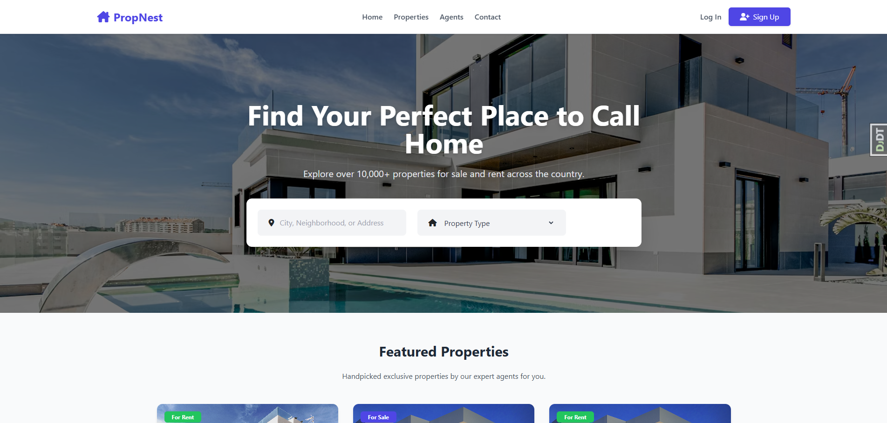
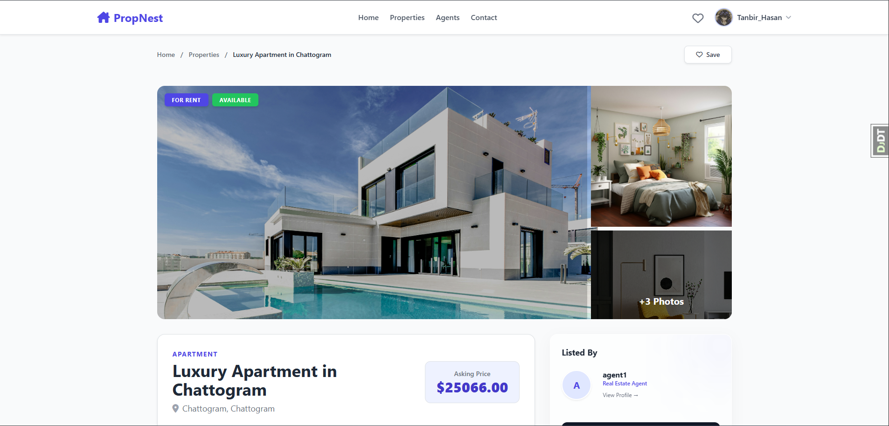
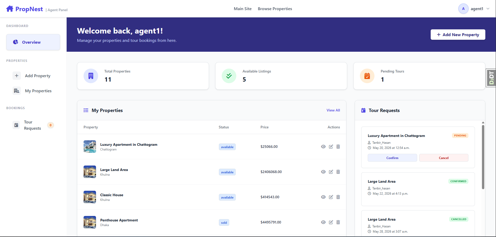
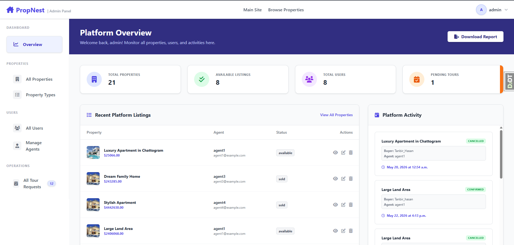

<div align="center">

<br/>

```
██████╗ ██████╗  ██████╗ ██████╗ ███╗   ██╗███████╗███████╗████████╗
██╔══██╗██╔══██╗██╔═══██╗██╔══██╗████╗  ██║██╔════╝██╔════╝╚══██╔══╝
██████╔╝██████╔╝██║   ██║██████╔╝██╔██╗ ██║█████╗  ███████╗   ██║   
██╔═══╝ ██╔══██╗██║   ██║██╔═══╝ ██║╚██╗██║██╔══╝  ╚════██║   ██║   
██║     ██║  ██║╚██████╔╝██║     ██║ ╚████║███████╗███████║   ██║   
╚═╝     ╚═╝  ╚═╝ ╚═════╝ ╚═╝     ╚═╝  ╚═══╝╚══════╝╚══════╝   ╚═╝   
```

### 🏡 A Full-Stack Real Estate Listing & Booking Platform

<br/>

[](https://python.org)
[](https://djangoproject.com)
[](https://postgresql.org)
[](https://tailwindcss.com)
[](https://getbootstrap.com)

<br/>

[](https://opensource.org/licenses/MIT)
[](http://makeapullrequest.com)
[](https://github.com/Tanbir-Hasan-247)
[](https://github.com/Tanbir-Hasan-247/Real-Estate-Listing-Booking-Platform/stargazers)

<br/>

[**Live Demo**](https://github.com/Tanbir-Hasan-247) · [**Report a Bug**](https://github.com/Tanbir-Hasan-247/Real-Estate-Listing-Booking-Platform/issues) · [**Request a Feature**](https://github.com/Tanbir-Hasan-247/Real-Estate-Listing-Booking-Platform/issues)

<br/>

</div>

---

## 📖 Table of Contents

- [About The Project](#-about-the-project)
- [Screenshots](#-screenshots)
- [Key Features](#-key-features)
- [Tech Stack](#-tech-stack)
- [Architecture Overview](#-architecture-overview)
- [Getting Started](#-getting-started)
  - [Prerequisites](#prerequisites)
  - [Installation](#installation)
  - [Environment Variables](#environment-variables)
- [Usage](#-usage)
- [Project Structure](#-project-structure)
- [Roadmap](#-roadmap)
- [Contributing](#-contributing)
- [Author](#-author)

---

## 🌟 About The Project

**PropNest** is a production-ready, multi-role real estate platform built with Django and PostgreSQL. It bridges the gap between **property buyers**, **real estate agents**, and **platform administrators** — all within a single, cohesive system.

Whether you're looking for your dream home, listing a property for rent, or managing an entire real estate portfolio, PropNest delivers a seamless, intuitive, and feature-rich experience.

> 💡 **Why PropNest?**  
> Most real estate platforms lack a clean, developer-friendly codebase. PropNest was built with scalability and readability in mind — featuring a role-based architecture, automated email notifications via Django Signals, and a modular design that's easy to extend.

---

## 📸 Screenshots

<div align="center">

| 🏠 Home Page | 🔍 Property Details |
|:---:|:---:|
|  |  |

| 🧑‍💼 Agent Dashboard | 🛡️ Admin Overview |
|:---:|:---:|
|  |  |

</div>

---

## ✨ Key Features

<details>
<summary><b>👤 User Roles & Authentication</b></summary>
<br/>

| Feature | Description |
|---|---|
| Custom User Model | Three built-in roles: `Admin`, `Agent`, and `Buyer` |
| Registration & Login | Secure user authentication with form validation |
| Email Activation | Account verification via tokenized email link |
| Session Management | Secure login/logout with session control |

</details>

<details>
<summary><b>🏢 Property Management (Agents)</b></summary>
<br/>

| Feature | Description |
|---|---|
| Full CRUD Operations | Create, Read, Update, and Delete property listings |
| Multiple Image Uploads | Attach and manage multiple images per property |
| Agent Dashboard | Monitor active listings, total properties, and incoming tour requests |
| Listing Status Control | Mark properties as active, rented, or sold |

</details>

<details>
<summary><b>🔍 Explore & Search (Buyers)</b></summary>
<br/>

| Feature | Description |
|---|---|
| Advanced Search & Filters | Filter by keyword, listing type (rent/sale), property type, bedrooms, and price range |
| Wishlist | Save and revisit favorite properties at any time |
| Tour Booking | Schedule in-person property tours directly from a listing |
| Buyer Dashboard | Track saved properties and tour request statuses |

</details>

<details>
<summary><b>🛡️ Admin Controls</b></summary>
<br/>

| Feature | Description |
|---|---|
| Platform Overview | Global dashboard with full visibility over all activity |
| User & Agent Management | View, edit, suspend, or permanently delete accounts |
| Global Tour Management | Intervene and update any tour request status platform-wide |
| Analytics-Ready Structure | Data structured for easy analytics integration |

</details>

<details>
<summary><b>✉️ Automated Email Notifications</b></summary>
<br/>

Powered by **Django Signals**, buyers automatically receive email alerts when:
- ✅ A tour request is **Confirmed** by an agent
- ❌ A tour request is **Cancelled**
- 🏁 A tour visit is marked as **Completed**

</details>

---

## 🛠️ Tech Stack

<div align="center">

| Layer | Technology |
|:---:|:---:|
| **Language** | Python 3.11+ |
| **Framework** | Django 6.0.3 |
| **Database** | PostgreSQL 16+ |
| **Frontend** | Tailwind CSS, Bootstrap 5, HTML5 |
| **Icons** | Font Awesome 6 |
| **Notifications** | Django Signals |
| **Auth Tokens** | `default_token_generator` (Email Verification) |
| **Dev Tools** | python-dotenv, Faker (for DB seeding) |

</div>

---

## 🏗️ Architecture Overview

```
┌─────────────────────────────────────────────────────────┐
│                        PropNest                         │
│                                                         │
│   ┌───────────┐   ┌───────────┐   ┌───────────────┐    │
│   │   Buyer   │   │   Agent   │   │  Administrator │    │
│   └─────┬─────┘   └─────┬─────┘   └───────┬───────┘    │
│         │               │                 │             │
│   ┌─────▼───────────────▼─────────────────▼────────┐   │
│   │              Django View Layer (FBV)            │   │
│   └─────────────────────┬───────────────────────────┘   │
│                         │                               │
│   ┌─────────────────────▼───────────────────────────┐   │
│   │         Django ORM  ←→  PostgreSQL DB           │   │
│   └─────────────────────┬───────────────────────────┘   │
│                         │                               │
│   ┌─────────────────────▼───────────────────────────┐   │
│   │         Django Signals → Email Notifications    │   │
│   └─────────────────────────────────────────────────┘   │
└─────────────────────────────────────────────────────────┘
```

---

## 🚀 Getting Started

### Prerequisites

Make sure you have the following installed on your machine:

- **Python** `>= 3.11` — [Download](https://python.org/downloads)
- **PostgreSQL** `>= 14` — [Download](https://www.postgresql.org/download/)
- **Git** — [Download](https://git-scm.com/)
- A Gmail account with an **App Password** enabled (for email notifications)

---

### Installation

**Step 1 — Clone the repository**

```bash
git clone https://github.com/Tanbir-Hasan-247/Real-Estate-Listing-Booking-Platform.git
cd Real-Estate-Listing-Booking-Platform
```

**Step 2 — Create and activate a virtual environment**

```bash
python -m venv venv

# On Windows
venv\Scripts\activate

# On macOS / Linux
source venv/bin/activate
```

**Step 3 — Install dependencies**

```bash
pip install -r requirements.txt
```

**Step 4 — Configure environment variables**

Create a `.env` file in the project root directory:

```bash
cp .env.example .env   # If an example file exists, otherwise create manually
```

Then open `.env` and fill in your values (see [Environment Variables](#environment-variables) below).

**Step 5 — Run database migrations**

```bash
python manage.py makemigrations
python manage.py migrate
```

**Step 6 — (Optional) Populate with fake data**

Seed the database with realistic fake properties, agents, and categories for testing:

```bash
python populateDB.py
```

**Step 7 — Create a superuser (Admin account)**

```bash
python manage.py createsuperuser
```

**Step 8 — Start the development server**

```bash
python manage.py runserver
```

🎉 Open your browser and navigate to **[http://127.0.0.1:8000/](http://127.0.0.1:8000/)**

---

### Environment Variables

The following environment variables are required. Add them to your `.env` file:

```env
# ─── Django ───────────────────────────────────────────────
SECRET_KEY=your_super_secret_django_key_here

# ─── Database (PostgreSQL) ────────────────────────────────
DB_NAME=propnest_db
DB_USER=your_postgres_username
DB_PASSWORD=your_postgres_password
DB_HOST=localhost
DB_PORT=5432

# ─── Email (Gmail SMTP) ───────────────────────────────────
EMAIL_HOST=smtp.gmail.com
EMAIL_USE_TLS=True
EMAIL_PORT=587
EMAIL_HOST_USER=your_email@gmail.com
EMAIL_HOST_PASSWORD=your_gmail_app_password
```

> ⚠️ **Security Note:** Never commit your `.env` file to version control. It's already listed in `.gitignore`.  
> 📩 **Gmail App Password:** Enable 2FA on your Google account, then generate an [App Password](https://myaccount.google.com/apppasswords).

---

## 🧭 Usage

Once the server is running, you can explore the platform with three different roles:

| Role | Access URL | What You Can Do |
|---|---|---|
| **Buyer** | `/register/` → Register as Buyer | Browse listings, save to wishlist, book tours |
| **Agent** | `/register/` → Register as Agent | Create & manage listings, respond to tour requests |
| **Admin** | `/admin/` or Admin Dashboard | Full platform control, user management |

---

## 📁 Project Structure

```
propnest/
│
├── accounts/            # Custom User Model, Auth Views (Register, Login, Logout)
├── properties/          # Property Model, CRUD Views, Search & Filter Logic
├── tours/               # Tour Booking Model & Views
├── wishlist/            # Buyer Wishlist (Saved Properties)
├── dashboard/           # Role-Based Dashboards (Buyer, Agent, Admin)
├── notifications/       # Django Signals for Email Notifications
│
├── templates/           # All HTML templates (organized by app)
├── static/              # CSS, JS, and static assets
├── media/               # Uploaded property images & screenshots
│
├── populateDB.py        # Faker-based DB seeding script
├── manage.py
├── requirements.txt
└── .env                 # Environment variables (not committed)
```

---

## 🗺️ Roadmap

Track the progress of upcoming features and improvements:

- [x] ✅ Role-based user system (Buyer, Agent, Admin)
- [x] ✅ Full property CRUD with multiple image uploads
- [x] ✅ Advanced property search and filtering
- [x] ✅ Tour booking system
- [x] ✅ Wishlist / Saved properties
- [x] ✅ Email notifications via Django Signals
- [x] ✅ Admin platform management dashboard
- [ ] 🔄 **Refactor to Class-Based Views (CBV)** — for cleaner, more scalable architecture
- [ ] 💳 **Payment Gateway Integration** — for premium listings or booking fees
- [ ] 🗺️ **Interactive Map Integration** — Google Maps for property locations
- [ ] ⭐ **Agent Reviews & Ratings** — buyer feedback system for agents
- [ ] 📱 **Mobile-Responsive Enhancements** — improved UX on small screens
- [ ] 🔔 **In-App Notifications** — real-time alerts alongside email

---

## 🤝 Contributing

Contributions are what make the open-source community amazing. Any contributions you make are **greatly appreciated**!

1. **Fork** the repository
2. **Create** your feature branch → `git checkout -b feature/AmazingFeature`
3. **Commit** your changes → `git commit -m 'Add some AmazingFeature'`
4. **Push** to the branch → `git push origin feature/AmazingFeature`
5. **Open a Pull Request**

Please make sure your code follows the existing style and includes relevant comments.

---

## 📄 License

Distributed under the **MIT License**. See [`LICENSE`](LICENSE) for more information.

---

## 👨‍💻 Author

<div align="center">

### Tanbir Hasan

*Aspiring Software Developer & Competitive Programmer*

<br/>

[](https://github.com/Tanbir-Hasan-247)
[](https://linkedin.com/in/)

<br/>

*If you found this project helpful, please consider giving it a ⭐ — it means a lot!*

</div>

---

<div align="center">

Made with ❤️ and ☕ by **Tanbir Hasan**

<br/>

*PropNest — Find your place in the world.*

</div>